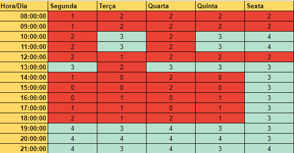

# Planejamento do Grupo

| **Data**   | **Versão** | **Descrição**        | **Autor(es)** |
| ---------- | :--------: | -------------------- | :-----------: |
| 15/09/2021 |    1.0     | Criação do Documento |  Pedro Lima   |

## Cronograma

| **Sprint** |    **Data**     | **Descrição**                                                                                                                                                                                                                                                                            |
| ---------- | :-------------: | ---------------------------------------------------------------------------------------------------------------------------------------------------------------------------------------------------------------------------------------------------------------------------------------- |
| Sprint 0   | 02/08 até 06/08 | <ul><li>Criação do documento de Visão do Projeto</li></ul>                                                                                                                                                                                                                               |
| Sprint 1   | 09/08 até 13/08 | <ul><li>Criação do backlog do Produto</li><li>Elicitação de requisitos</li></ul>                                                                                                                                                                                                         |
| Sprint 2   | 16/08 até 20/08 | <ul><li>Criação de documento de arquitetura</li><li>Ajuste de visão do projeto</li><li>Criação da wiki</li></ul>                                                                                                                                                                         |
| Sprint 3   | 23/08 até 27/08 | <ul><li>Estrutura de requisitos de acordo com o SAFe</li><li>Quadro Kanban do Projeto</li></ul>                                                                                                                                                                                          |
| Sprint 4   | 30/08 até 03/09 | <ul><li>Aplicar técnicas e práticas para a definição e avaliação do Backlog usando PBB</li></ul>                                                                                                                                                                                         |
| Sprint 5   | 06/09 até 10/09 | <ul><li>Implementar a estrutura de rastreabilidade em ferramenta de apoio</li><li>Aprimorar o PBB</li><li>Criar BDD</li></ul>                                                                                                                                                            |
| Sprint 6   | 13/09 até 17/09 | <ul><li>Implementar o backlog da sprint</li><li>Ajustar BDD</li><li>Implementar US01</li><li>Implementar US03</li></ul>                                                                                                                                                                  |
| Sprint 7   | 20/09 até 24/09 | <ul><li>Aplicação das ferramentas, métodos e técnicas de requisitos para a construção do produto</li><li>Criar critérios de validação das inspeções</li><li>Guia de estilo</li><li>Implementar US06</li><li>Implementar US08</li><li>Implementar US16</li><li>Implementar US17</li></ul> |
| Sprint 8   | 27/09 até 01/10 | <ul><li>Implementar US18</li><li>Implementar US21</li><li>Implementar US28</li><li>Implementar US30</li></ul>                                                                                                                                                                            |
| Sprint 9   | 04/10 até 08/10 | <ul><li>Implementar US32</li><li>Implementar US34</li><li>Implementar US02</li><li>Implementar US07</li><li>Entrega do MVP1</li></ul>                                                                                                                                                    |
| Sprint 10  | 11/10 até 15/10 | <ul><li>Detalhamento de casos de uso da sprint</li><li>Implementar US22</li><li>Implementar US29</li><li>Implementar US31</li><li>Implementar US33</li><li>Implementar US11</li></ul>                                                                                                    |
| Sprint 11  | 18/10 até 22/10 | <ul><li>Implementar US12</li><li>Implementar US13</li><li>Implementar US23</li><li>Implementar US25</li><li>Implementar US26</li></ul>                                                                                                                                                   |
| Sprint 12  | 25/10 até 29/10 | <ul><li>Entrega final</li></ul>                                                                                                                                                                                                                                                          |

## Disponibilidade dos integrantes

<figcaption>Os números representam a quantidade de pessoas com disponibiliade naquele horário.</figcaption>

