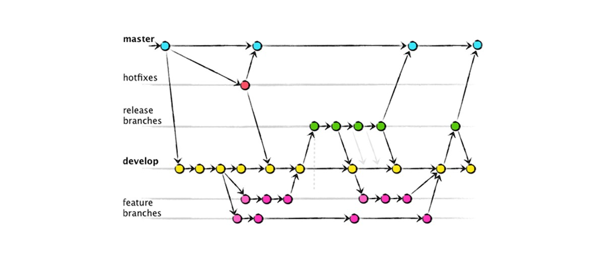

## Plano de Gerência de Configuração de Software
## 1.0 Política de Commits

## 2.0 Política de Branches

Seguimos o modelo de branch do gitflow, como pode ser visto na imagem abaixo:

<!--  -->

### 2.1 Repositórios

### 2.2 Repositório Studyt wiki

## 3.0 Política de Aprovação do Código

## 4.0 Uso de Issues

