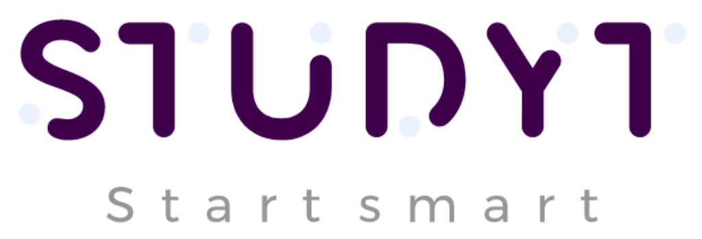

 
 

# Introdução

#### [Studyt-Frontend](https://github.com/Studyt/studyt-front)

#### [Studyt-Backend](https://github.com/Studyt/studyt-back)

## Sobre

## Equipe

 

  

    

        
            

              

                <a href="https://github.com/Arthur-Matos">Arthur Alves</a>
              

            

    

    

        
          

            

            <a href="https://github.com/DLBrianPina">Brian Pina</a>
            

          

    

    

    
        

          

          <a href="https://github.com/CibeleG">Cibele Goudinho</a>
          

        

        

    

    
        

          

          <a href="https://github.com/Victor-Buendia">Victor Buendia</a>
          

        

        

    

    
        

          

          <a href="https://github.com/pedrolimass">Pedro Lima</a>
          

        

        

  

## Licença

Este projeto está licenciado sob os termos da [licença MIT]().

Copyright (c) 2021 Studyt
